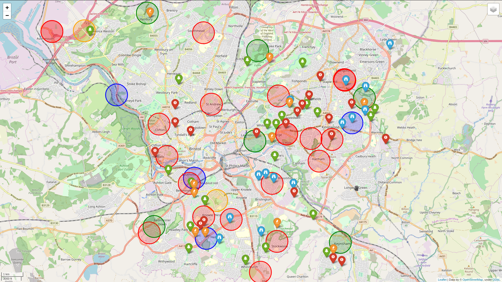

# TheftMapper

## Introduction
In Bristol, England (and in England in general) there is a significant (motor)bike theft problem. This program
was created to map the reports of theft onto a map and provide some level of interaction.

## Installation

[Python3](https://www.python.org/) and the [folium](https://github.com/python-visualization/folium) package
must be installed on the system.
To install folium:

        pip install folium

## Map
### Example
Shown below is data scraped from facebook for a 6-week period (from January 2020) in Bristol, England.

### Key
The generated map visualises the various types of reports in various manners.

* Red items indicate a stolen bike.
* Orange items indicate a burnt wreck of a bike.
* Blue items indicate a sighting of a stolen bike (in use on the roads)
* Green items indicate a found motorbike (not a wreck)

For reports with an accurate location a marker will be shown.
For reports with an inaccurate location a circle will be shown.
Each of these will show the date and a hyperlink (if given in the report) when clicked on.

## Report Data
The program does not provide any data. This is the responsibility of the user to collect and format.
The data must be comma-separated in a text file and formatted in the following manner:

        <timestamp>,<date>,<longitude>,<latitude>,<accurate>,<link>,<type>,<notes>

### timestamp (optional)
This is time at which the entry was added to the file. It can be left empty.
### date
Date of the theft report in day/month/year format (all numbers)
### longitude
Decimal number of the theft location. Do not use N/S. To indicate a Southern longitude use a negative(-) symbol
### latitude
Decimal number of the theft latitude. Do not use E/W. To indicate a Western latitude use a negative(-) symbol
### accurate
As some reports can be vague it is better to visualise them as such. Yes==accurate. No==inaccurate. (case-insensitive)
### link (optional)
A web-address to the report. It can be left empty.
### type
The report type. Valid values are: *burnt*, *found*, *sighting*, *stolen*. (case-insensitive)
### notes (optional)
Any extra information. Currently not used.